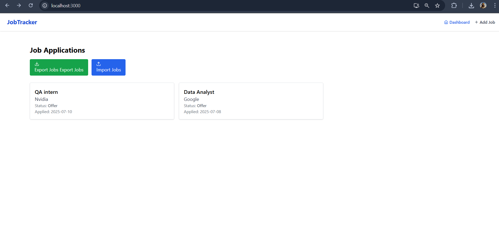

# 📂 Job Tracker App – React + Tailwind + Context

Track and manage your job applications easily with this full-featured, responsive web app.
Built using **React**, **Tailwind CSS**, and **Context API**, it allows you to create, view, edit, delete, export, and import job application records — all stored locally in your browser.

---

## 🔥 Features

- ✅ **Dashboard** view to list all job applications
- ✅ **Add Job** form with fields like company, title, status, date, and notes
- ✅ **Job Details Page** with full info, edit & delete options
- ✅ **JSON Export/Import** for backing up and restoring your job list
- ✅ **Global State Management** using React Context API
- ✅ **Responsive Layout** using TailwindCSS (mobile & desktop)
- ✅ **LocalStorage** persistence — no backend needed
- ✅ **Modern UI** with icons (React Icons) and clean design

---

## 🧪 Tech Stack

| Technology   | Purpose                           |
| ------------ | --------------------------------- |
| React        | UI & component-based architecture |
| React Router | Multi-page routing                |
| Context API  | Global state management           |
| TailwindCSS  | Utility-first styling             |
| React Icons  | Icon library for modern visuals   |
| LocalStorage | Persist data in-browser           |

---

## 📸 Screenshots



---

## 🛠️ Setup Instructions

1. **Clone the repo**

```bash
git clone https://github.com/your-username/job-tracker-app.git
cd job-tracker-app
```


2. **Install dependencies**

   ```
   npm install
   ```
3. **Start the app**

   ```
   npm start
   ```
4. **Open in browser**

## 🗃 JSON Export / Import

* **Export:** Downloads your job list as a `.json` file
* **Import:** Upload a `.json` file to restore or merge data

> ⚠️ Data is stored locally in your browser using `localStorage`


## 🧑‍💻 Author

**Usman Khan**

Web Developer

[LinkedIn](www.linkedin.com/in/usman-khan55) www.linkedin.com/in/usman-khan55
